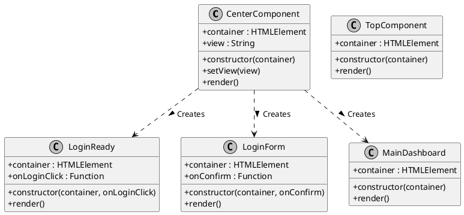
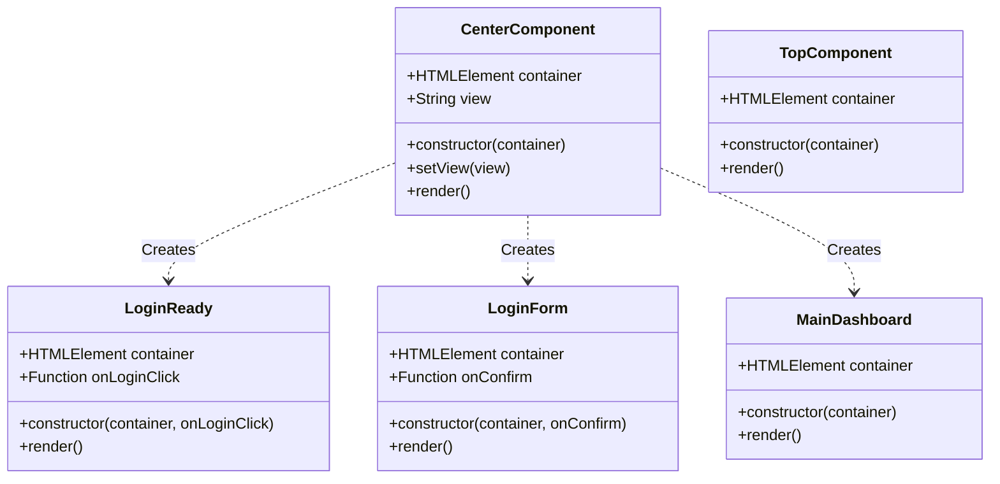

# 컴포넌트 클래스 다이어그램

## PlantUML (Draw.io 호환)

Draw.io에서 **Arrange > Insert > Advanced > PlantUML** 메뉴를 통해 아래 코드를 붙여넣으면 다이어그램이 생성됩니다.

```plantuml
@startuml
' 스타일 설정
skinparam classAttributeIconSize 0
skinparam monochrome true

class CenterComponent {
    +container : HTMLElement
    +view : String
    +constructor(container)
    +setView(view)
    +render()
}

class TopComponent {
    +container : HTMLElement
    +constructor(container)
    +render()
}

class LoginReady {
    +container : HTMLElement
    +onLoginClick : Function
    +constructor(container, onLoginClick)
    +render()
}

class LoginForm {
    +container : HTMLElement
    +onConfirm : Function
    +constructor(container, onConfirm)
    +render()
}

class MainDashboard {
    +container : HTMLElement
    +constructor(container)
    +render()
}

' 관계 정의
CenterComponent ..> LoginReady : Creates >
CenterComponent ..> LoginForm : Creates >
CenterComponent ..> MainDashboard : Creates >

@enduml
```

## Mermaid (GitHub 호환)

```mermaid
classDiagram
    class CenterComponent {
        +HTMLElement container
        +String view
        +constructor(container)
        +setView(view)
        +render()
    }

    class TopComponent {
        +HTMLElement container
        +constructor(container)
        +render()
    }

    class LoginReady {
        +HTMLElement container
        +Function onLoginClick
        +constructor(container, onLoginClick)
        +render()
    }

    class LoginForm {
        +HTMLElement container
        +Function onConfirm
        +constructor(container, onConfirm)
        +render()
    }

    class MainDashboard {
        +HTMLElement container
        +constructor(container)
        +render()
    }

    CenterComponent ..> LoginReady : Creates
    CenterComponent ..> LoginForm : Creates
    CenterComponent ..> MainDashboard : Creates
```
