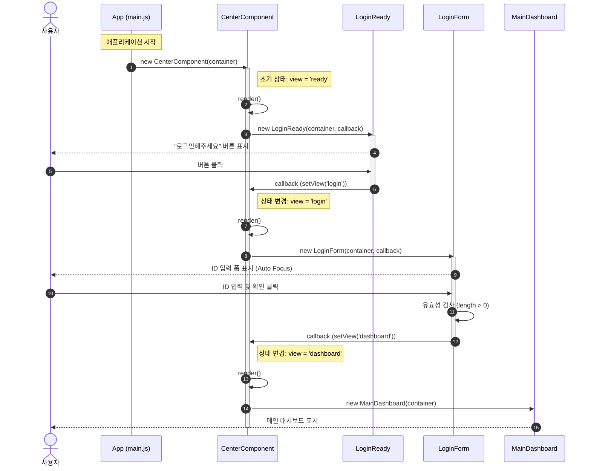

# 로그인 흐름 시퀀스 다이어그램

아래 다이어그램은 `main.js`부터 시작하여 컴포넌트 간의 상호작용 및 상태 변화를 보여줍니다.

```mermaid
sequenceDiagram
    autonumber
    actor User as 사용자
    participant App as App (main.js)
    participant Center as CenterComponent
    participant UI_Ready as LoginReady
    participant UI_Form as LoginForm
    participant UI_Dash as MainDashboard

    Note over App: 애플리케이션 시작
    App->>Center: new CenterComponent(container)
    activate Center
    Note right of Center: 초기 상태: view = 'ready'
    Center->>Center: render()
    Center->>UI_Ready: new LoginReady(container, callback)
    activate UI_Ready
    UI_Ready-->>User: "로그인해주세요" 버튼 표시

    User->>UI_Ready: 버튼 클릭
    UI_Ready->>Center: callback (setView('login'))
    deactivate UI_Ready
    
    Note right of Center: 상태 변경: view = 'login'
    Center->>Center: render()
    Center->>UI_Form: new LoginForm(container, callback)
    activate UI_Form
    UI_Form-->>User: ID 입력 폼 표시 (Auto Focus)

    User->>UI_Form: ID 입력 및 확인 클릭
    UI_Form->>UI_Form: 유효성 검사 (length > 0)
    UI_Form->>Center: callback (setView('dashboard'))
    deactivate UI_Form

    Note right of Center: 상태 변경: view = 'dashboard'
    Center->>Center: render()
    Center->>UI_Dash: new MainDashboard(container)
    activate UI_Dash
    UI_Dash-->>User: 메인 대시보드 표시
    deactivate Center
```
